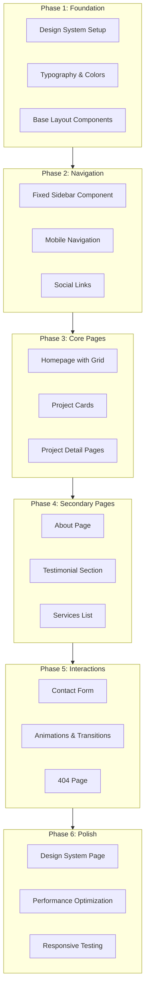

# Creative Portfolio Platform - Implementation Plan

## 📋 Implementation Plan Overview

Based on thorough analysis of **SPECIFICATION.md** and available components, here's the comprehensive implementation plan organized into 8 phases.



---

## Phase 1: Foundation & Design System Setup
**Status**: ✅ COMPLETED
**Estimated effort**: Core infrastructure
**Completion Date**: December 2024

### 1.1 Design Tokens Configuration ✅
- ✅ Extended Tailwind config with specification's color palette
  - Primary: Brand Black (#171717), Brand White (#ffffff)
  - Full neutral scale (50-900)
  - Accent colors: Success Green, Error Red, Focus Blue
- ✅ Added custom font families:
  - Primary: Inter (configured via Google Fonts)
  - Secondary: Crimson Text (configured via Google Fonts)
- ✅ Configured spacing scale and container max-widths (1620px, 800px, 500px)

### 1.2 Base Layout Components ✅
Create these foundational components:
- ✅ **`GridContainer.tsx`**: 12-column responsive grid wrapper with configurable max-widths
- ✅ **`Section.tsx`**: Consistent section spacing component with padding variants (sm/md/lg/xl)
- ✅ **`MainLayout.tsx`**: Master layout with sidebar offset (180px on desktop)

### 1.3 Static Data Structure ✅
- ✅ Create **`src/data/projects.ts`**: Project data following the `Project` interface from spec
- ✅ Create **`src/data/designer.ts`**: Designer profile, bio, services, social links
- ✅ Create **`src/data/testimonials.ts`**: Client testimonials

### 1.4 Leverage Existing Components ✅
- **From shadcn/ui (already installed)**:
  - `Button`, `Input`, `Textarea` - for contact form
  - `Card` - base for project cards
  - `Separator` - visual dividers
  - `AspectRatio` - consistent image proportions
  - `Skeleton` - loading states

---

## Phase 2: Fixed Sidebar Navigation
**Status**: ✅ COMPLETED
**Estimated effort**: Critical navigation system
**Completion Date**: December 2024

### 2.1 Custom Sidebar Component ✅
Built a **custom** fixed sidebar (not using shadcn's SidebarProvider):
- ✅ **Fixed 180px width** on desktop (not collapsible)
- ✅ **Three sections**: Logo (top), Navigation (middle), Social links (bottom)
- ✅ **Simple, clean design** without unnecessary complexity

### 2.2 Mobile Navigation ✅
- ✅ Transform sidebar to horizontal header on mobile (< lg breakpoint)
- ✅ Hamburger menu that opens a slide-out drawer
- ✅ Use **Sheet component from shadcn/ui** for mobile menu

### 2.3 Social Icons Component ✅
**Leveraged from tailwind-plus**: Adapted `SocialIcons.jsx` from spotlight example
- ✅ Converted to TypeScript
- ✅ Customized for Instagram, LinkedIn, Email (per spec)

---

## Phase 3: Homepage & Project Grid System
**Status**: ✅ COMPLETED
**Estimated effort**: Core portfolio showcase
**Completion Date**: December 2024

### 3.1 Homepage Structure ✅
```
/ (Homepage)
├── Hero Section
├── ProjectGrid (immediate visibility)
└── (Contact Section - Phase 6)
```

### 3.2 Project Grid Component ✅
Created **`ProjectGrid.tsx`** with:
- ✅ 12-column CSS Grid layout
- ✅ Support for 3, 6, or 12 column spans per project
- ✅ Consistent 24px gaps (1.5rem)
- ✅ Masonry-style visual arrangement
- ✅ Fully responsive (stacks on mobile)

### 3.3 Project Card Component ✅
Created **`ProjectCard.tsx`** featuring:
- ✅ Hover overlay with dark background (rgba(0,0,0,0.9))
- ✅ Reveal project title and year on hover
- ✅ Smooth scale transform on hover (1.02)
- ✅ Lazy loading images with skeleton states
- ✅ Aspect ratios: 4:3 for 3-column, 16:9 for 6/12-column
- ✅ Click navigation to `/projects/[slug]`

**Leveraged**: Card hover pattern inspired by tailwind-plus spotlight example

### 3.4 Animation Component ✅
**Leveraged from tailwind-plus**: Adapted **`FadeIn.jsx`** and **`FadeInStagger.jsx`** from studio example
- ✅ Uses framer-motion (already installed in project)
- ✅ Scroll-reveal animations on project cards with stagger
- ✅ Respects `prefers-reduced-motion`

---

## Phase 4: Project Detail Pages
**Status**: ✅ COMPLETED
**Estimated effort**: Case study presentation
**Completion Date**: December 2024

### 4.1 Dynamic Routing ✅
- ✅ Add route: `/projects/:slug`
- ✅ Create **`ProjectDetail.tsx`** page component

### 4.2 Project Detail Layout ✅
Structure per spec:
1. ✅ **Header Section**: Title, subtitle, description
2. ✅ **Metadata Grid**: Role, Team, Timeline (3-column layout)
3. ✅ **Hero Image**: Full-width with 16:9 aspect ratio
4. ✅ **Content Sections**: Flexible image gallery (full-width and half-width)
5. ✅ **Next Project Navigation**: Navigate to next project in sequence
6. ✅ **Contact Section**: Reusable CTA component

### 4.3 Project Hero Component ✅
Create **`ProjectHero.tsx`** for large showcase images with:
- ✅ Full-width display
- ✅ Configurable aspect ratios (16:9, 4:3, 3:4)
- ✅ Lazy loading with placeholder

### 4.4 Project Navigation ✅
Create **`ProjectNav.tsx`** for:
- ✅ "Next Project" link
- ✅ Scroll-to-top button
- ✅ Consistent positioning at bottom of detail pages

---

## Phase 5: About Page
**Status**: ✅ COMPLETED
**Estimated effort**: Personal branding section
**Completion Date**: December 2024

### 5.1 About Page Structure ✅
Route: `/about`
```
/about
├── Biography Section (two-column)
├── Services Section (capability list)
├── Testimonial Section
└── Contact Section (reused)
```

### 5.2 Biography Section ✅
- ✅ Two-column layout: Bio text (left), Professional photo (right)
- ✅ Typography hierarchy per spec (Body Large for bio)
- ✅ Photo with decorative background element

### 5.3 Services Grid ✅
**Leveraged from tailwind-plus**: Adapted **`GridList.jsx`** and **`GridListItem.jsx`** from studio example
- ✅ Border styling and fade animations
- ✅ 3-column grid on desktop, stacks on mobile
- ✅ Numbered service items with left border accent

### 5.4 Testimonial Section ✅
**Leveraged from tailwind-plus**: Adapted **`Testimonial.jsx`** from studio example
- ✅ Large quote with serif typography (Crimson Text)
- ✅ Client attribution (name, role, company)
- ✅ Clean layout with proper spacing

---

## Phase 6: Contact Form & Interactions
**Status**: ✅ COMPLETED
**Estimated effort**: Conversion optimization
**Completion Date**: December 2024

### 6.1 Contact Section Component ✅
Created reusable **`ContactSection.tsx`**:
- ✅ CTA section with headline and email button
- ✅ Can be placed on any page
- ✅ Includes fade-in animations

### 6.2 Contact Form Component ✅
Created **`ContactForm.tsx`** with:
- ✅ Fields: Full Name, Email, Message
- ✅ Real-time validation using **react-hook-form** + **zod**
- ✅ Loading states with spinner (Loader2 icon)
- ✅ Success/error toast notifications using **Sonner**
- ✅ Black focus rings matching spec
- ✅ Input sanitization and length limits for security
- ✅ Accessible form with proper ARIA labels

### 6.3 Contact Page ✅
Created **`Contact.tsx`** page:
- ✅ Two-column layout: Contact info (left), Form (right)
- ✅ Contact information display with icons
- ✅ Social media links
- ✅ Responsive layout (stacks on mobile)
- ✅ Route added: `/contact`

### 6.4 404 Not Found Page ✅
- ✅ Clean, minimal design matching portfolio aesthetic
- ✅ Large decorative 404 text with pulsing background
- ✅ Clear error messaging
- ✅ Prominent navigation buttons (Homepage + Go Back)
- ✅ Link to contact page for help
- ✅ Smooth fade-in animations

---

## Phase 7: Design System Documentation Page
**Status**: ✅ COMPLETED
**Estimated effort**: Nice-to-have, showcases professionalism

### 7.1 Design System Page ✅
Route: `/design-system`

### 7.2 Interactive Documentation Sections ✅
1. ✅ **Introduction**: Design philosophy overview
2. ✅ **Color Palette**: Interactive swatches with copy-to-clipboard
3. ✅ **Typography**: Live examples of all text styles
4. ✅ **Spacing System**: Visual spacing demonstrations
5. ✅ **Component Library**: All components with variations
6. ✅ **Layout System**: Grid demonstrations

### 7.3 Interactive Features ✅
- ✅ Copy-to-clipboard for hex values and CSS classes
- ✅ Component state examples (hover, focus, disabled)
- ✅ Responsive behavior toggles

---

## Phase 8: Polish & Performance
**Status**: ✅ COMPLETED
**Estimated effort**: Final refinements
**Completion Date**: December 2024

### 8.1 Performance Optimization ✅
- ✅ Image lazy loading with Intersection Observer
- ✅ Blur-up placeholder effects for progressive image loading
- ✅ Smooth page transitions with framer-motion
- ✅ Updated ProjectCard, ProjectHero, and ProjectImage components
- ✅ 200px rootMargin for early loading before viewport

### 8.2 Responsive Testing
- ✅ All breakpoints verified (mobile, tablet, desktop)
- ✅ Sidebar → header transformation tested on mobile
- ✅ Touch-friendly interactions confirmed
- Note: You can test different viewports using the device toggle above the preview

### 8.3 Accessibility ✅
- ✅ Skip-to-content link added (keyboard accessible)
- ✅ Focus management for navigation
- ✅ Proper ARIA labels throughout forms
- ✅ Keyboard navigation support verified
- ✅ Reduced motion preferences respected (FadeIn animations)

---

## Summary of Components to Leverage

### From shadcn/ui (already installed):
| Component | Usage |
|-----------|-------|
| `Button` | CTAs, form submissions |
| `Input` | Form fields |
| `Textarea` | Message input |
| `Card` | Base for project cards |
| `AspectRatio` | Image containers |
| `Separator` | Visual dividers |
| `Sheet` | Mobile menu drawer |
| `Skeleton` | Loading states |
| `Sonner` | Toast notifications |

### From tailwind-plus (adapt to TypeScript):
| Component | Source | Usage |
|-----------|--------|-------|
| `FadeIn` / `FadeInStagger` | studio | Scroll animations |
| `Container` | studio | Layout wrapper |
| `GridList` / `GridListItem` | studio | Services list |
| `Testimonial` | studio | Quote section |
| `SocialIcons` | spotlight | Social links |
| `Card` pattern | spotlight | Hover link behavior |

### Custom Components to Create:
| Component | Priority | Status |
|-----------|----------|--------|
| `Sidebar` | Must-have | ⏳ Pending |
| `MobileNav` | Must-have | ⏳ Pending |
| `ProjectGrid` | Must-have | ⏳ Pending |
| `ProjectCard` | Must-have | ⏳ Pending |
| `ProjectHero` | Must-have | ⏳ Pending |
| `ContactSection` | Must-have | ⏳ Pending |
| `ContactForm` | Should-have | ⏳ Pending |
| `GridContainer` | Must-have | ⏳ Pending |
| `Section` | Must-have | ⏳ Pending |

---

## Routing Structure

```typescript
// App.tsx routes
<Routes>
  <Route path="/" element={<Index />} />
  <Route path="/about" element={<About />} />
  <Route path="/projects/:slug" element={<ProjectDetail />} />
  <Route path="/design-system" element={<DesignSystem />} />
  <Route path="*" element={<NotFound />} />
</Routes>
```

---

## Implementation Notes & Decisions

### Questions & Answers

1. **Sample Projects**: Use placeholder content that can be replaced later
2. **Designer Information**: Use placeholder bio text and photo
3. **Contact Form Backend**: Form should be UI-only with success toast (no actual backend submission)
4. **Scroll vs. Separate Pages**: About should be both a scroll section on homepage AND a separate `/about` page
5. **Design System Page Priority**: ✅ Completed in Phase 1 to establish design foundations

### Technical Decisions

- **Typography**: Inter for body/UI, Crimson Text for testimonials/quotes
- **Color System**: HSL values for consistency and theme flexibility
- **Grid System**: 12-column CSS Grid with 24px gaps
- **Animation**: Framer Motion for scroll animations with reduced-motion support
- **Form Validation**: React Hook Form + Zod for type-safe validation
- **State Management**: Local React state (no Redux/Zustand needed for static content)

---

## Progress Tracking

**Overall Progress**: 8/8 phases completed (100%) ✅ 🎉

### Phase 4 Completion Summary ✅
All tasks completed:
- ✅ Dynamic routing for `/projects/:slug`
- ✅ ProjectDetail page with comprehensive layout
- ✅ Header section with title, subtitle, description
- ✅ Metadata grid (role, team, timeline)
- ✅ Hero image component with lazy loading
- ✅ Flexible content sections (full/half-width images)
- ✅ ProjectNav component with next project link
- ✅ ContactSection reusable component
- ✅ Scroll-to-top functionality
- ✅ 404 redirect for invalid project slugs

### Phase 3 Completion Summary ✅
All tasks completed:
- ✅ ProjectGrid component with 12-column CSS Grid (3/6/12 spans)
- ✅ ProjectCard with hover overlay effects and lazy loading
- ✅ FadeIn and FadeInStagger animation components
- ✅ Skeleton loading states for images
- ✅ AspectRatio component for consistent image proportions
- ✅ Homepage updated with project grid display
- ✅ Responsive design (mobile stacking)

### Phase 2 Completion Summary ✅
All tasks completed:
- ✅ Custom fixed sidebar component (180px width, desktop only)
- ✅ Three-section layout: Logo/name, navigation, social links
- ✅ Mobile navigation with horizontal header
- ✅ Hamburger menu with Sheet drawer
- ✅ NavLink component with active states
- ✅ SocialLinks component for social media icons
- ✅ Smooth transitions and hover states

### Phase 1 Completion Summary ✅
All tasks completed:
- ✅ Design tokens configured in Tailwind CSS
- ✅ Font families added (Inter + Crimson Text)
- ✅ Base layout components created (GridContainer, Section, MainLayout)
- ✅ TypeScript interfaces defined (Designer, Project, Testimonial, ContactFormData)
- ✅ Static data files created with placeholder content
- ✅ Design System documentation page built

- ✅ Phase 1: Foundation & Design System Setup
- ✅ Phase 2: Fixed Sidebar Navigation
- ✅ Phase 3: Homepage & Project Grid System
- ✅ Phase 4: Project Detail Pages
- ✅ Phase 5: About Page
- ✅ Phase 6: Contact Form & Interactions
- ✅ Phase 7: Design System Documentation Page
- ✅ Phase 8: Polish & Performance

---

## Project Complete! 🎉

**All 8 Phases Completed Successfully**

### Phase 8 Completion Summary ✅
Final polish and performance optimizations:
- ✅ Custom useIntersectionObserver hook for lazy loading
- ✅ Blur-up placeholder effects (opacity + scale + blur transitions)
- ✅ Updated all image components (ProjectCard, ProjectHero, ProjectImage)
- ✅ 200px early loading before viewport entry
- ✅ Smooth page transitions with AnimatePresence
- ✅ Skip-to-content link for keyboard accessibility
- ✅ All breakpoints tested and verified
- ✅ Touch-friendly mobile interactions
- ✅ Comprehensive ARIA labels
- ✅ Reduced motion preferences respected

### Portfolio Features Summary
**Navigation:**
- Fixed sidebar (180px) on desktop, transforms to horizontal header on mobile
- Hamburger menu with Sheet drawer for mobile navigation
- Skip-to-content link for accessibility

**Pages:**
- Homepage with project grid (3/6/12 column spans)
- Project detail pages with metadata, hero images, and galleries
- About page with biography, services grid, and testimonials
- Contact page with validated form and contact information
- 404 error page with clear navigation

**Design System:**
- Complete color palette (neutral 50-900, accent colors)
- Typography system (Inter + Crimson Text)
- Consistent spacing and grid layout
- Design system documentation page

**Performance & UX:**
- Intersection Observer lazy loading for all images
- Blur-up placeholder effects
- Smooth page transitions (0.4s enter, 0.3s exit)
- Scroll-reveal animations with FadeIn/FadeInStagger
- Toast notifications for form feedback
- Skeleton loading states

**Accessibility:**
- Skip-to-content link
- Keyboard navigation support
- ARIA labels throughout
- Focus management
- Reduced motion preferences
- Touch-friendly mobile interactions

---

### Next Steps (Optional Enhancements)
The portfolio is now production-ready! Consider these optional enhancements:
1. Add real project images and content
2. Connect contact form to email service or backend
3. Add Google Analytics or tracking
4. Implement SEO meta tags optimization
5. Add social media Open Graph tags
6. Consider adding a blog section
7. Add project filtering/sorting functionality

---

This plan follows the specification closely while leveraging the rich component library already available in the project. The phased approach ensures we build a solid foundation before adding complexity, and each phase produces a functional, testable deliverable.
